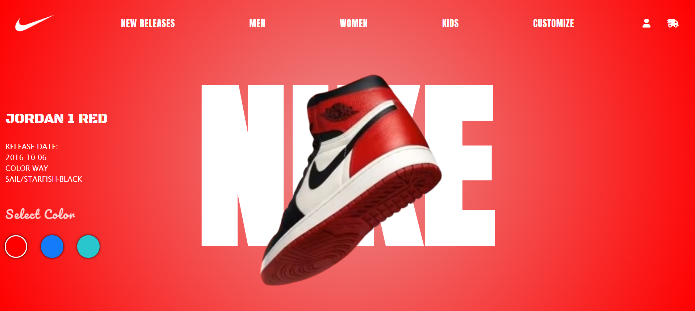
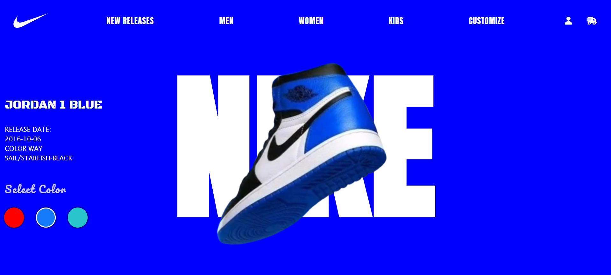
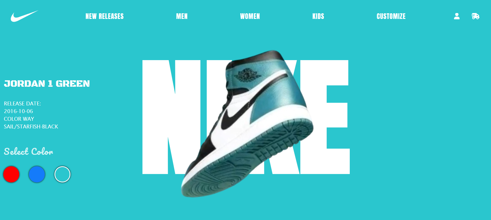
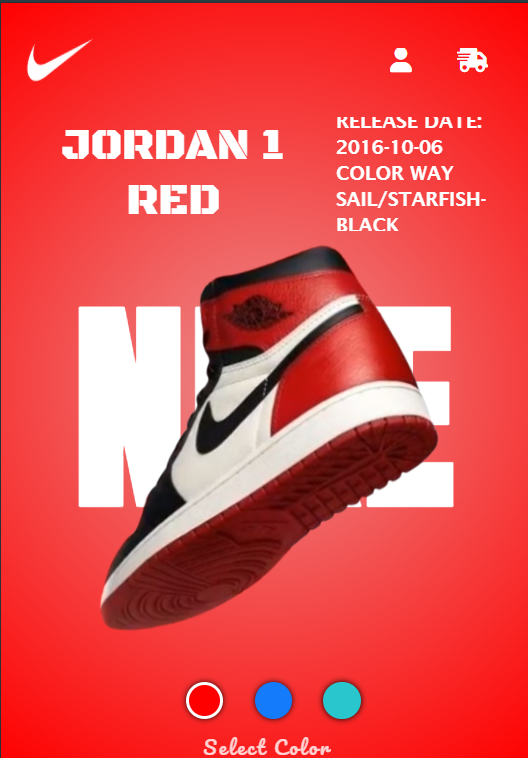
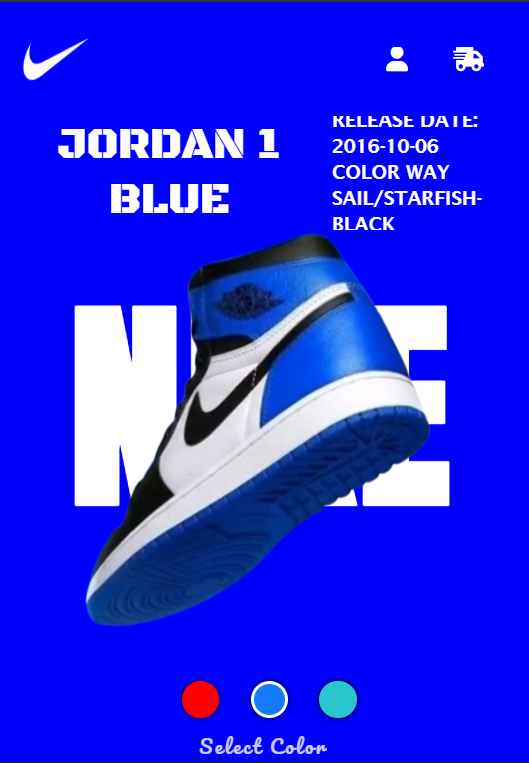
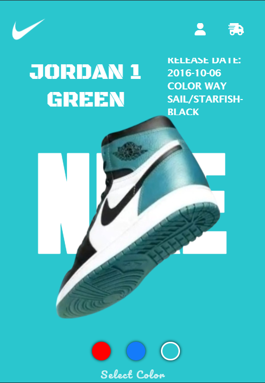

<h1 align="center" style="font-size:40px;">Nike Shoe Slider</h1>
<h3 align="center">Responsive | Animated | Visually attractive Shoe collection Landing Page (Hero Section), Utilized Document Object Model (DOM) efficiently that stuns like a Slider Component.</h3>

---
 
## 🎬 Website Demo

  
  
  


<p align="center">
  
  
  
</p>

---

## 📂 Folder Structure

Nike:
1. assets # 📽️ Related Images
2. index.html # 📱 HTML File
3. nike.css # 🧠 CSS File
4. nike.js # 🧪 JS File

---

### Clone the repo
```bash
git clone https://github.com/nryadav18/Nike.git
cd Nike
```

### Running the Server
##Open with Live Server
